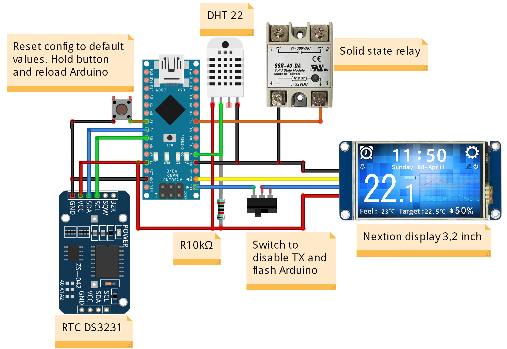

# ThermalController
DIY remote (wired) home weather station based on Arduino Nano, Nextion display, DS3231 rtc module, DHT22 digital temperature and humidity sensor and solid-state relay to control any heater in 3D printed body

## Warning

## Required libraries
- [NextionLite](https://github.com/VirtualVFix/ThermalController/tree/master/libraries/NextionLite)
- [Adafruit_Unified_Sensor](https://github.com/adafruit/Adafruit_Sensor)
- [DHT_sensor_library](https://github.com/adafruit/DHT-sensor-library)
- [MD_DS3231](https://github.com/MajicDesigns/MD_DS3231)

## Scheme

## UI tutorial

#### Home page:

[1] Heater control on/off icon. Heater control may be disabled in main setting page 
[*] RealFeel temperature calculates based on current temperature and humidity

#### Main settings page:

[1] Down temperature threshold to enable heater after target temperature reached

#### Additional settings page:

#### Timer settings page:

#### Date and time settings page:

[1] Week day calculates automatically according to month day and year
